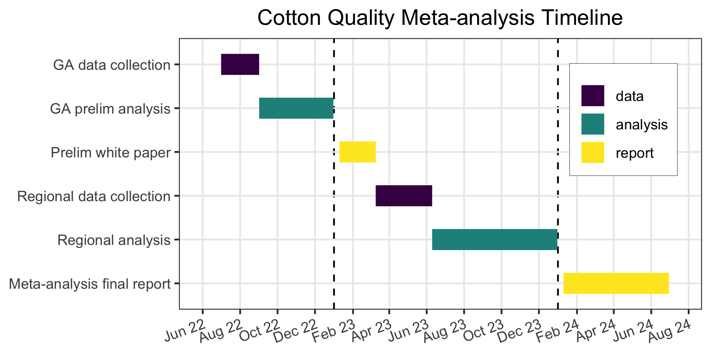

# Gantt Chart timeline code

This repo serves as an example code to create timelines in R as Gantt charts, as in the figure below:

## Instructions  

1. Download/clone this repository to your local machine.  

2.  Go on `data` folder, and edit the file `timeline.xlsx` by changing the columns

  - `name` (name of event you want to appear on y axis)\
  - `start` with the event start date\
  - `end` with the event end date\
  - `type` is a general event type in case you want to color-code it

3.  Launch the RStudio project located on the main folder

4.  Launch the script found inside the `quarto` folder

5.  Run script. Make adjustments on plot if wish, and export it to file.

5.  That's all.
